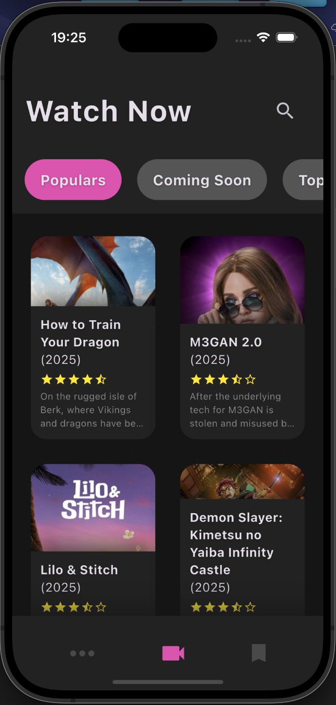
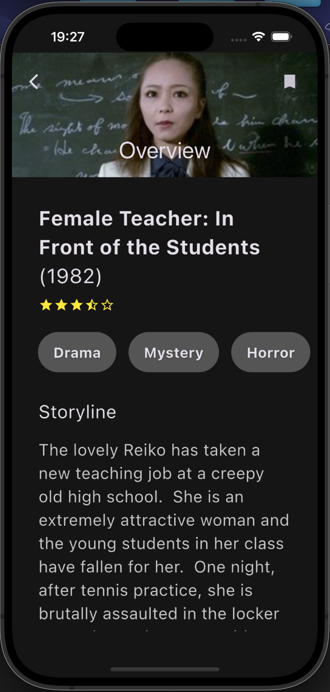
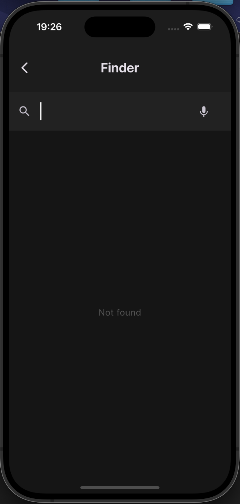
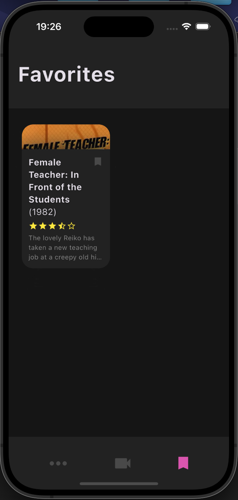
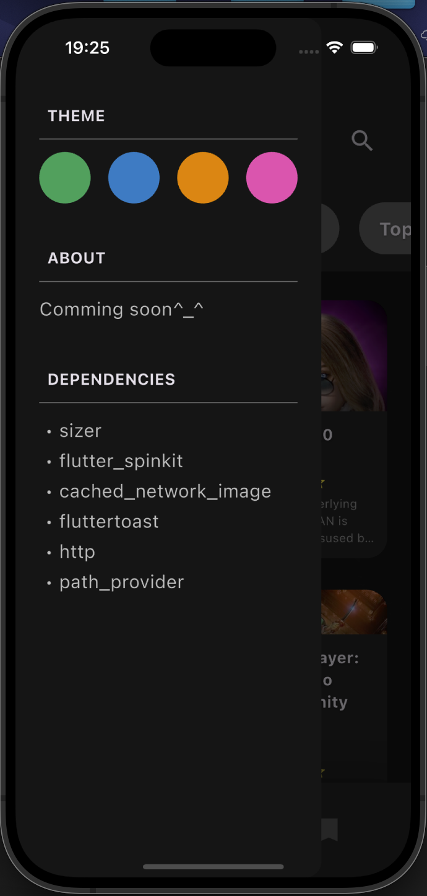

# 🎬 TMDB Flutter Movie App

Приложение на Flutter, использующее API [The Movie Database (TMDb)](https://www.themoviedb.org/) для отображения информации о фильмах: популярные, топовые, ожидаемые, а также поиск и детали каждого фильма.

## 📱 Скриншоты

<!-- Добавьте свои скриншоты ниже (если есть) -->






## 🚀 Функционал

- 📌 Просмотр популярных, топовых и ожидаемых фильмов
- 🔍 Поиск фильмов по названию
- ❤️ Добавление фильмов в избранное (локально)
- 🌐 Получение информации с TMDB API
- 💾 Кеширование изображений
- 🎨 Поддержка адаптивной верстки

## 🧑‍💻 Стек технологий

- **Flutter**
- **Dart**
- [`dio`](https://pub.dev/packages/dio) — для работы с HTTP
- [`cached_network_image`](https://pub.dev/packages/cached_network_image) — для загрузки и кеширования изображений
- [`sizer`](https://pub.dev/packages/sizer) — адаптивная верстка
- [`flutter_spinkit`](https://pub.dev/packages/flutter_spinkit) — анимация загрузки

## ⚙️ Установка

1. Склонируйте репозиторий:

```bash
git clone https://github.com/KarandeyMaksim/TMDB.git
cd TMDB